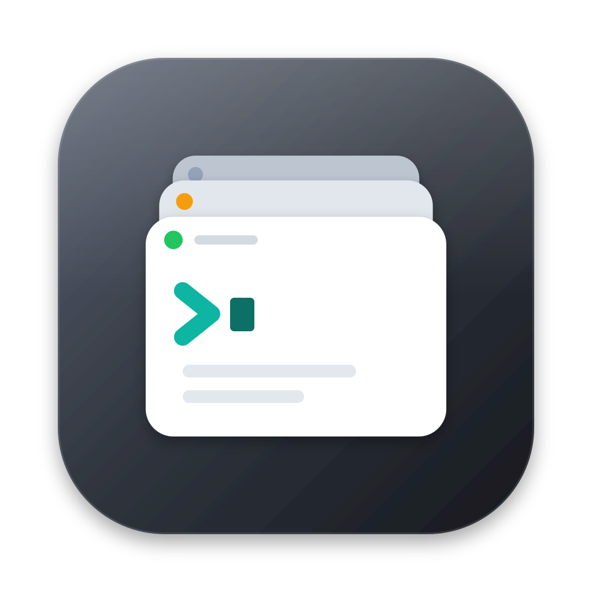

<p align="center"></p>

# Muxbar

**A native macOS menu-bar app for running many AI coding agent sessions at once (Claude Code,
Codex, Gemini CLI, or any CLI) on your Mac and remote SSH hosts. Sessions run in tmux, survive
disconnects, and show at a glance which ones are working, idle or waiting for you.**

Sessions are listed in a sidebar on the left, and the selected session's live terminal sits on
the right. Each agent runs unmodified in a real terminal (a tmux session). Muxbar never wraps the
CLI, calls a model API or types for you. It:

- lists, names and groups sessions across hosts,
- keeps remote sessions alive in tmux, so a VPN drop, a closed laptop or an expired SSH
  credential doesn't kill them,
- shows each session's status (**working**, **waiting for input**, **idle**) by reading the
  screen, and pins sessions that need you at the top (⌘J jumps to the next one),
- resumes agent conversations, including ones started outside Muxbar.

```
┌ Muxbar ─────────────────┬──────────────────────────────────────────────┐
│ This Mac                │ ● api-refactor · devbox · ~/src/api   ✎  🗑  │
│  ● docs-site   Waiting  │──────────────────────────────────────────────│
│ devbox                  │ ✻ Considering… (6s · thinking)               │
│ ▸● api-refactor Working │ ──────────────────────────────────────────── │
│  ● perf-fix    Idle     │ ❯ _                                          │
│ + New Session           │  [api-refactor] 0:claude*                    │
└─────────────────────────┴──────────────────────────────────────────────┘
```

## Works with any agent

New sessions run a **default command** when their terminal opens. It is `claude` out of the box,
and you can change it in Settings to `codex`, `gemini`, `grok`, `aider`, anything else, or leave
it empty for a plain shell. You can also override it per session in **New Session**.

| Agent | Status detection | Resume by id | Lists past conversations |
|---|---|---|---|
| Claude Code (`claude`) | ✅ | `claude --resume <id>` | `~/.claude/projects` |
| OpenAI Codex CLI (`codex`) | ✅ | `codex resume <id>` | `~/.codex/sessions` |
| Google Gemini CLI (`gemini`) | ✅ | `gemini --resume <id>` | `~/.gemini/tmp/*/chats` |
| Any other CLI | ✅ from its process and generic screen cues | via `customAgents` (below) | — |

Status is a heuristic read from the pane's processes and last screen lines. When it isn't sure it
says **Unknown** rather than guessing.

### Adding your own agent

A default command that isn't a built-in agent (say `grok`) is recognised automatically by its
process name. To give a tool resume support or its own status cues, add it to `customAgents` in
`~/Library/Application Support/Muxbar/state.json` (under `settings`):

```json
"customAgents": [{
  "id": "grok",
  "name": "Grok CLI",
  "command": "grok",
  "processNames": ["grok"],
  "resumeTemplate": "grok --resume {id}",
  "continueCommand": "grok --continue",
  "waitingMarkers": ["Approve tool call?"],
  "workingMarkers": ["esc to stop"]
}]
```

Only `id` and `command` are required. A custom entry with a built-in's `id` overrides that preset.

## Requirements

| | |
|---|---|
| Mac | macOS 14.5 or later with Command Line Tools (`xcode-select --install`). No Xcode or Python needed. [Homebrew](https://brew.sh) is used to install tmux if you don't have it. |
| Local tmux | Installed for you by `./install.sh` (via Homebrew or MacPorts). Use `--no-tmux` to skip it; local sessions are then plain windows that don't survive being closed. |
| Remote hosts | Any host reachable through an alias in your `~/.ssh/config`, with tmux ≥ 2.6. |
| Terminal | None needed. Muxbar has a built-in terminal (SwiftTerm), and Terminal.app or iTerm2 can be chosen in Settings instead. |

## Install

```bash
git clone https://github.com/ganeshpanaskar/muxbar.git
cd muxbar && ./install.sh
```

The installer asks once for a **workspace root** (default `~/muxbar-sessions`; or pass `--root PATH`).
It builds the app on your Mac and installs it to `~/Applications/Muxbar.app`, so Gatekeeper
doesn't block it and no signing account is needed. It then starts in the menu bar.

Then:
1. Click the Muxbar icon, then the gear, and tick any remote hosts. The list comes from
   `~/.ssh/config`, which Muxbar reads but never edits.
2. Set the **Default command** (e.g. `claude`, `codex`, `gemini`).
3. Optional: Settings → **Open Muxbar at login**.

**Update:** `git pull && ./install.sh`. **Uninstall:** `./install.sh --uninstall`. It asks
before deleting your data and never touches tmux sessions.

## Using it

- **New session:** pick a host, folder, name, command (prefilled with the default) and an
  optional group. Muxbar creates a tmux session in that folder and runs the command. When the
  command exits, you're left in a login shell.
- **Workspace folders:** leave **Folder** empty and Muxbar creates `<root>/<group>/<session>` on
  that host. The folder follows renames and group moves. Muxbar only moves folders it created and
  never deletes anything.
- **Groups:** each group belongs to one host. Drag sessions onto a group, or right-click a
  session → **Move to Group**.
- **Continue Agent Session…:** lists recent Claude Code, Codex and Gemini CLI conversations on a
  host (with folder and first prompt). Pick one, or paste an agent, a folder and a session id,
  and Muxbar resumes it in a new session.
- **Ended sessions** (e.g. after a host reboot): click **Resume Session**. Muxbar recreates the
  session with the same name, folder and group, and continues its agent's conversation there.
- **Sessions you start yourself** (`tmux new -s foo`) appear under the host's **Others** section
  within 30 seconds.
- **Status dot:** blue = working, orange = waiting for you, green = idle, grey = no agent
  running, faint = unknown.

### Command line

The app binary also accepts commands, which it sends to the running app:

```bash
M=~/Applications/Muxbar.app/Contents/MacOS/Muxbar
$M --cli list
$M --cli new --host devbox --name api-refactor --dir ~/src/api --cmd codex
$M --cli conversations --host local
$M --cli resume --host local --id <session-id>                        # looks up its agent & folder
$M --cli resume --host local --id <session-id> --dir ~/src/x --agent gemini
$M --cli settings-set --default-command gemini
$M --cli          # full usage
```

## Privacy

- Nothing leaves your Mac except SSH to your own hosts. Muxbar never contacts any AI provider.
- It keeps one shared SSH connection per host (`~/.muxbar/cm/`) with `BatchMode`, so it never
  hangs on a password prompt.
- State is plain JSON at `~/Library/Application Support/Muxbar/state.json`. Logs are at
  `~/Library/Logs/Muxbar/app.log`.
- In Terminal/iTerm2 mode, macOS asks once for Automation permission. Muxbar only opens, names
  and focuses windows, and types a single command to start or reattach a session.

## Known limitations

- **Status is heuristic.** Agent UIs change. A new version can make a session show Unknown until
  the patterns (pinned by fixtures in `Tests/MuxbarCoreTests/Fixtures/status`) are updated.
- **The built-in terminal is SwiftTerm.** If something renders wrong, switch Settings → "Open
  sessions in" to iTerm2.
- **Terminal.app opens one window per session**, not tabs. Use iTerm2 for tabs.

## Development

```bash
make test      # unit tests (swift-testing, Command Line Tools only)
make install   # build, bundle, ad-hoc sign, install, relaunch
HOST=local scripts/e2e.sh                       # end-to-end suite against the running app + local tmux
HOST=devbox REMOTE=devbox scripts/e2e.sh        # …against a remote ssh host
```

The E2E suite only creates or kills tmux sessions named `muxbar-e2e-*`.

- `Sources/MuxbarCore`: pure logic (agents, probe script and parser, quoting, SSH, status
  classifier, conversation discovery, reconciler, persistence). All of it is unit-tested.
- `Sources/Muxbar`: the app (SwiftUI menu bar and window, session store, terminal drivers,
  control socket and `--cli`).

Contributions are welcome. See [CONTRIBUTING.md](CONTRIBUTING.md).

## License

[MIT](LICENSE)
